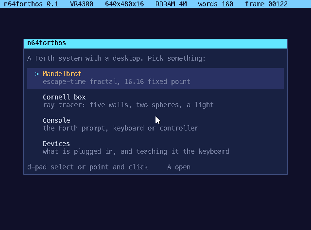
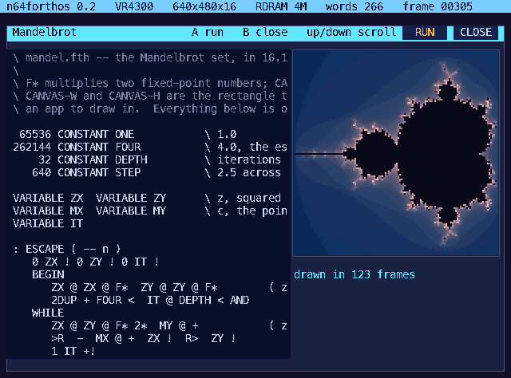
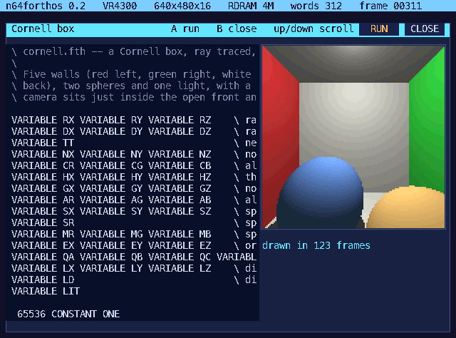
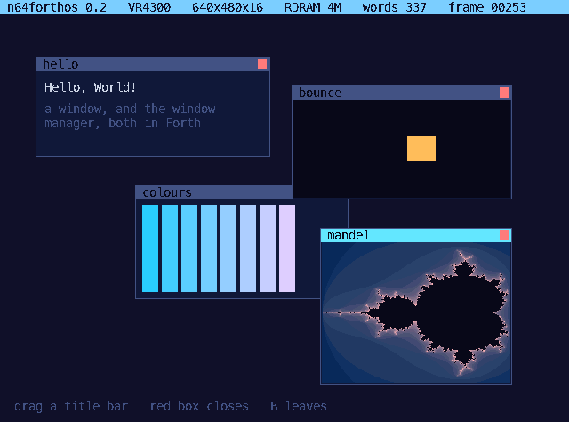
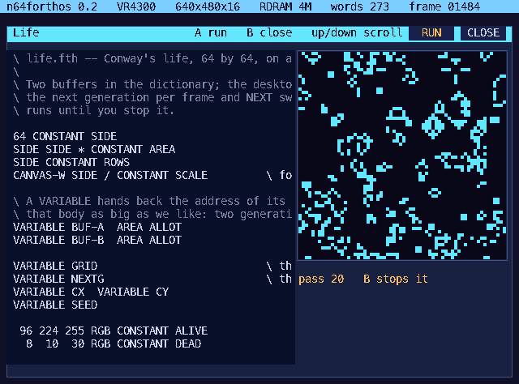
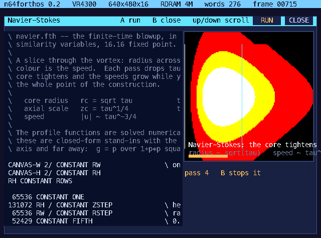

# n64forthos

A Forth operating system for the Nintendo 64. It boots from its own
cartridge, brings up 640×480 in sixteen bits a pixel, compiles the part of
itself that is written in Forth, and puts a desktop on the screen.



Seven things sit on that desktop. Four of them are **the Forth source you are
looking at**: the window shows the code, and the button beside it runs that
code into the canvas next to it.




One of them is a **window manager, also written in Forth** — overlapping
windows you drag by their title bars, each one a canvas and a clip handed to
a Forth word once a frame.



And the console is a real Forth prompt. With nothing but a controller you
type on an on-screen keyboard; with a [BlueRetro](https://blueretro.io)
adapter the N64 takes a Bluetooth **mouse and keyboard**, and the desktop
grows a pointer while the prompt takes dictation.

```bash
make            # build/n64forthos.z64, a 64 MiB cartridge image
make serve      # http://127.0.0.1:8795 -- run it in a browser, with your
                # own mouse and keyboard wired into it
make test       # boot it headless: 139 Forth assertions and 35 system checks
make gui        # run it in mupen64plus
```

---

## What it is

Everything below runs on a **stock console**: 4 MiB of RDRAM with no
Expansion Pak, and a 64 MiB cartridge that is nothing but mask ROM.

**A cartridge that boots the way cartridges boot.** The PIF copies the first
0x1000 bytes into RSP data memory and jumps to 0xA4000040; that code —
[`src/ipl3.S`](src/ipl3.S), 72 bytes of it — puts the kernel in RDRAM and
enters it. [`src/entry.S`](src/entry.S) clears CP0 status, invalidates both
caches a line at a time, sets up a stack, zeroes `.bss` and calls `kmain`.
Exception vectors are installed, so a bad address in Forth paints a halt
screen with Cause, EPC and BadVAddr rather than wandering off.

**A Forth, not a Forth-flavoured interpreter.** Token threaded, dictionary in
RDRAM, 133 primitives, `:` compiles, `SEE` decompiles what is actually in
memory, `FORGET` rolls the dictionary back, and Forth addresses *are* machine
addresses — `@` and `!` reach the hardware.

```
ok> : SQUARE DUP * ;   7 SQUARE .
49
ok> SEE HELLO
: HELLO ." Hello, World!" CR ;
```

**A system written in itself.** [`src/system.fth`](src/system.fth) is
compiled at boot out of the ROM, a line at a time: the palette, the drawing
words, the window, the greeting. The applications are the same thing with
their own windows.

**A graphics layer where libultra would have been.** What Nintendo shipped as
a C library is here as words that take pixels on the stack:

```forth
: HELLO-WINDOW
   408 192 216 120 PANEL
   S" Hello, World!"  416 192 INKY  DRAW-TEXT
   S" a window drawn" 416 224 WHITE DRAW-TEXT ;
```

`PLOT BOX FRAME HLINE VLINE LINE DRAW-TEXT BLIT BLIT-SPRITE CLS FB RGB VSYNC
FRAMES`, plus 16.16 fixed point (`F* F/ FSQRT`) and `CANVAS-X/Y/W/H`, the
rectangle the desktop lends an application. The whole set is in
[docs/WORDS.md](docs/WORDS.md).

## The applications

Each one is asked for **one row per frame**, so the machine keeps reading its
controller while a picture paints, the window reports its progress, and B
stops a render half way without closing it.

**Mandelbrot** ([src/apps/mandel.fth](src/apps/mandel.fth)) — escape-time, 32
iterations, 16.16 fixed point, one sample per 2×2 block. A full canvas is
460M instructions: **4.9 seconds** of VR4300.

**Cornell box** ([src/apps/cornell.fth](src/apps/cornell.fth), 135 lines) — a
ray tracer: five walls, two spheres, one light and a shadow ray. Plane and
sphere intersections, normals, Lambert shading and shadow rays, all in fixed
point, all in Forth. About seven seconds a frame.

**Navier–Stokes** ([src/apps/navier.fth](src/apps/navier.fth)) — the
finite-time blowup, in the paper's own similarity variables: a slice through
the vortex with the speed as colour. Each pass drops τ by a fifth, so the
core radius (√τ) tightens and the speeds (τ^−3/4) grow while you watch. 70M
instructions a pass — **under a second**, so it animates. A Forth cousin of
[superfx-navier-stokes](https://github.com/keithadler/superfx-navier-stokes),
which did the same construction on a Super FX chip.

**Windows** ([src/apps/wm.fth](src/apps/wm.fth)) — a window manager, written
in Forth. The kernel draws rectangles, text and a pointer, and clips what it
is told to clip; what a window *is*, which one is in front, and what happens
when you drag a title bar are all up here in the language. A window is seven
cells — position, size, title, and the word that draws its contents — and
that word runs with the canvas and the clip set to the window's inside, so it
cannot draw anywhere else even if it tries.


Repainting everything every frame would flicker, so the chrome is drawn when
something moves and only the contents are drawn between times, each inside
its own window.

One of the four demonstration windows computes: it renders a couple of rows
of an escape-time fractal a frame into its own canvas, notices when it has
been carried somewhere else and starts again, and the other windows go on
animating around it.

**Life** ([src/apps/life.fth](src/apps/life.fth)) — Conway's life, 64×64 on a
torus, two generations held in the dictionary. A generation a pass, and it
runs until you stop it.



**Console** — the prompt, on the on-screen keyboard or a real one.

**Devices** — what answered on each of the four joybus channels, live, and
the place to teach the system a real keyboard's key codes.

Each application is a file in [src/apps](src/apps), compiled into the
dictionary when its window opens and rolled back out of it when the window
closes.



### Forth compiled to MIPS

A definition is compiled to machine code the moment it is finished, and
[`src/native.c`](src/native.c) walks the token thread the word already has
and writes instructions out. Nothing about the front end changes: the thread
stays where it was, which is what `SEE` decompiles and `FORGET` reclaims, and
a word the generator will not take is simply left interpreted. The boot log
says how many of each.

The convention is one register wide. A compiled word takes the Forth stack
pointer in `$a0`, returns it in `$v0` and keeps it in `$t8` while it runs;
the helpers in the kernel take and return it the same way, so a call costs
four instructions rather than a round trip through memory. The stack's two
limits sit in `$s1` and `$s2` and every move of the pointer is checked
against them; `@` and `!` check their address and alignment inline. Compiled
code is written through the uncached alias and the instruction cache is
invalidated over it — the part an emulator would never have made you do.

| | interpreted | compiled | a full frame |
| --- | --- | --- | --- |
| Cornell box | 18,769 instructions a pixel | **2,719** — 6.9× | 1.5 s |
| Navier–Stokes | 1,548 | **498** — 3.1× | 0.3 s a pass |
| Mandelbrot | 4,278 | **1,416** — 3.0× | 0.8 s |

Thirty-odd words are inlined rather than called — the stack shuffles, the
arithmetic and comparisons, `@` and `!` with their checks, the shifts, `MIN`
and `MAX`, `>R` and `R>` straight onto the return stack, and `F*` through the
64-bit product. Everything else is a call to the same primitive the
interpreter runs.

Three of the bugs in getting here are worth keeping: a stack check at word
entry cannot be sound across a loop; `lui`/`lw` sign-extends its offset, so
the upper half needs rounding up; and a branch offset counts from *after* the
delay slot, which made an inlined `MIN` return the larger of the two. The
last one is the reason [`test/tests.fth`](test/tests.fth) now runs its
arithmetic twice — once interpreted, once inside definitions, because only
the second is compiled and the two have to agree. 139 assertions.

### What optimisation actually bought

Measured, not guessed — `tools/bench.py` counts instructions a pixel and
`tools/profile.py` samples the program counter:

| change | effect |
| --- | --- |
| one ray per 2×2 block, in both renderers | **4× faster** |
| a row per frame instead of a whole frame | the UI stays alive |
| `-Os` to `-O2` | **1.4× faster** |
| `2DUP`/`2DROP` as primitives rather than Forth | 1% |
| `F/` rewritten to use the CPU's divider | 1.3% |
| a fast path for hot words in the inner interpreter | **nothing** — `prim()` was already inlined; reverted |
| `-O3` | **slower**, and bigger; reverted |
| the RDP filling rectangles instead of the CPU | **2.4×** on the interface |
| compiling definitions to MIPS | **3–7×** on the applications |

The floor used to be the interpreter itself, at about 36 instructions per
Forth word. Both ways past it are now taken: the RDP does the fills, and
definitions are compiled. What is left is the RSP, which is eight lanes of
16-bit arithmetic sitting idle — and microcode is a different kind of
project, because the applications would stop being Forth.

## Mouse and keyboard

The kernel identifies each joybus channel once a second and reads whatever is
there: a controller (`0x0500`), an N64 Mouse (`0x0200`) or a Randnet Keyboard
(`0x0002`) — which is exactly the set a BlueRetro adapter can present over
Bluetooth. The mouse moves a pointer the desktop draws and rubs out itself;
its buttons click the launcher, the RUN and CLOSE buttons, and the keys of
the on-screen keyboard.

The keyboard is the honest weak spot: the transport is implemented, but the
**Randnet key codes are from documentation and have never met the real
keyboard**. So the system does not pretend. The Devices window shows the raw
code of whatever you press, and walks you through the alphabet building a
table, which it prints as Forth you can paste into `system.fth`:

```
ok> 42 65 KEY!   ( A )
```

Our own emulator sends ASCII down the wire, which the default table maps
straight through — so in the browser and in the tests, typing simply works.

## In a browser, with your own mouse and keyboard

`make serve` puts it at <http://127.0.0.1:8795>, running in
[`web/n64emu.js`](web/n64emu.js) — the same interpreter as the test harness,
ported to the browser precisely so the page can hand the OS real input: your
mouse arrives as an N64 Mouse on channel 2 and your keyboard as a Randnet
Keyboard on channel 3. Click the picture to give it the mouse; type at the
prompt.

It runs at 35–60M instructions a second in a normal window, against the
VR4300's 93.75M — half speed, and the desktop is idle most of the time
anyway.

## Real hardware

Not yet tested on a console. [docs/HARDWARE.md](docs/HARDWARE.md) is the
practical guide — what to put on the cart, what you should see and in what
order, what each failure would mean, how to set up a BlueRetro adapter, and
how to teach the system a real keyboard. In short, two things stand between
here and a flashcart, and both are known:

1. **RDRAM is not initialised.** Emulators hand it to you working. On
   hardware the boot block has to configure the RI and the RDRAM modules
   before anything can be written to memory.
2. **The PIF checks the boot block against the CIC**, and only Nintendo's
   IPL3 — or a deliberate checksum collision like the free one in
   [libdragon](https://github.com/DragonMinded/libdragon) — passes.

Both are solved by an IPL3 that does the work, so the build takes one:

```bash
make IPL3=path/to/ipl3.bin      # a 0xFB8-byte boot block that isn't ours
```

The kernel itself asks nothing of the boot block beyond being at 0x80000400
with RDRAM working, and `build/kernel.elf` is there for a loader that would
rather have an ELF.

## How it is tested

`make test` boots two cartridges with no window and no console:

**A test cartridge** runs [`test/tests.fth`](test/tests.fth) at boot and
leaves the pass and fail counts in RDRAM, where
[`tools/check.py`](tools/check.py) reads them back out of the emulator. 139
assertions, thirteen of them deliberate errors — divide by zero, unaligned
store, an `IF` that never closes, a dictionary overflow, a stack overflow —
each followed by assertions that the system still computes and still has an
empty stack.

**The real cartridge** is driven like a person would drive it: press A, move
the pointer, click, type. Thirty-odd checks cover the boot console, the
prompt with both keyboards, and both renderers -- including that the Cornell
box comes out red on the left and green on the right. Its console is checked by *decoding the framebuffer
back to text* — the kernel draws exact 8×16 glyphs, so
[`tools/screen.py`](tools/screen.py) matches each cell against the same font
and turns the screen into eighty columns of characters. "The console says
Hello, World!" is then a string comparison covering boot block, kernel,
Forth, console and video interface.

The emulator underneath is [`tools/n64emu.py`](tools/n64emu.py), written for
this repo. It boots from the cartridge header, so the boot block is under
test too, implements the integer MIPS subset this kernel uses plus the VI,
PI and SI registers it touches, and *raises* on anything it does not
implement rather than quietly doing the wrong thing. Controllers, mice and
keyboards are emulated on the joybus, which is how the tests can type.

## Robustness

The kernel is written to survive its user, because its user is a prompt.

- The dictionary has a limit and every allocation checks it.
- A definition that fails is unlinked and its space reclaimed: `: BADX IF ;`
  leaves `HERE` exactly where it was.
- Control flow compiles on its own stack, so `LOOP` without `DO` is a message
  rather than a corrupt thread.
- `@ ! C@ C! +! FILL TYPE DUMP` check range and alignment; a bad address is
  refused, not faulted.
- Stacks are bounded and report overflow and underflow.
- Source is read a line at a time: an error costs you the line, and the line
  it was on is printed under the message.
- `FORGET` will not eat the kernel's own words.

## Layout

```
src/ipl3.S      the boot block the PIF runs out of RSP DMEM
src/entry.S     kernel entry: caches, stack, .bss, exception landing pad
src/kernel.c    bring-up, boot log, the handover to the desktop
src/video.c     the video interface: 640x480, 16bpp, interlaced NTSC
src/gfx.c       every routine that touches a pixel, including the pointer
src/console.c   text in its own columns, with a status bar
src/input.c     joybus: controllers, mice, keyboards
src/repl.c      the prompt and the on-screen keyboard
src/desktop.c   the launcher, the application windows, the devices window
src/forth.c     dictionary, inner interpreter, compiler, primitives
src/system.fth  the part of the system written in Forth
src/apps/*.fth  the applications, which are also their own source listing
test/tests.fth  the test suite, also written in Forth
tools/          font, boot source packer, cartridge builder, emulator, checks
web/            the page, and the emulator ported to JavaScript
```

Built with Homebrew's LLVM, which targets big-endian MIPS out of the box, and
lld. There is no cross-gcc to build.

## Where this got to

Everything described above works, is tested, and is in this repository. The
system boots, compiles itself, runs applications written in its own language,
takes a mouse and a keyboard, and manages windows. Rendering is three to
seven times faster than where it started, and the interface is no longer the
part that costs anything: a full screen rebuild is about ten milliseconds,
and an idle frame touches a few hundred pixels.

Three things were deliberately left for later, and none of them is hiding:

**A console has not seen it yet.** The boot block does not initialise RDRAM,
and the PIF checksums it against the CIC — both solved by handing
`make IPL3=...` a boot block that does the work.
[docs/HARDWARE.md](docs/HARDWARE.md) is the guide for the day the hardware
arrives, including what each failure would mean and how to teach the system a
real Randnet keyboard, whose codes are still unverified.

**The RSP is idle.** Eight lanes of sixteen-bit arithmetic, and the
applications spend all their time on exactly the sort of maths it exists for.
It is the last large multiplier, and taking it would mean the applications
stop being Forth you can read in the window beside the picture — which is why
it was not taken.

**The window manager is an application, not the shell.** Making it the shell
— the launcher as a Forth window, applications opening as windows — is the
obvious next step and a contained one.

## Licence

MIT.
