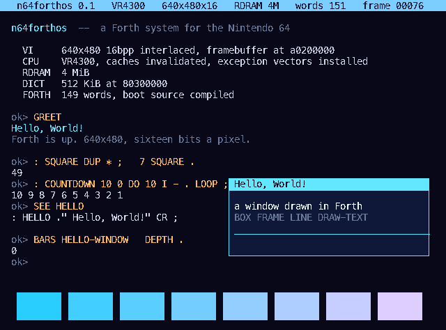
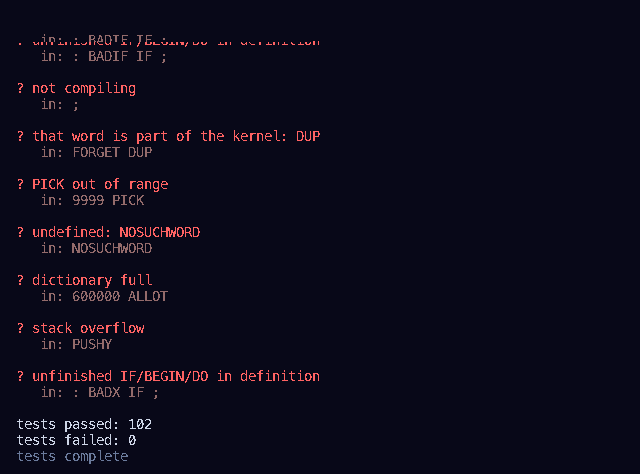

# n64forthos

A Forth system for the Nintendo 64. It boots from its own cartridge, brings
up 640×480 in sixteen bits a pixel, compiles the part of itself that is
written in Forth, and says hello.



The goal is a Forth-based operating system with a desktop, running on stock
hardware: a 64 MiB cartridge of plain mask ROM, no save chip, no expansion
pak, no coprocessor. This is the first floor of it — the boot block, the
kernel, the dictionary, the console, and the drawing words the window system
will be built from.

```bash
make            # build/n64forthos.z64, a 64 MiB cartridge image
make test       # boot it headless, 102 assertions + the boot screen
make serve      # http://127.0.0.1:8795 -- run it in a browser
make gui        # run it in mupen64plus, in a window
```

---

## What is actually there

**It boots the way the console boots.** The PIF copies the first 0x1000 bytes
of the cartridge into RSP data memory and jumps to 0xA4000040; that code —
[`src/ipl3.S`](src/ipl3.S), 72 bytes of it — copies the kernel into RDRAM at
0x80000400 and jumps. The kernel entry
([`src/entry.S`](src/entry.S)) clears the CP0 status word, invalidates both
caches a line at a time, sets up a stack, zeroes `.bss` and calls `kmain`.
Exception vectors are installed at 0x80000000 and friends, so a bad address
in Forth paints a halt screen with Cause, EPC and BadVAddr instead of
wandering off.

**The video interface is programmed directly.** NTSC timing, interlaced,
16-bit RGBA5551, a 640×480 framebuffer at 0x80200000 written through the
uncached alias so nothing has to be flushed before the VI reads it. The VI
shows 474 of those 480 lines, which is what the standard `VI_V_START` asks
for and what a television would have displayed.

**The Forth is a real Forth.** Token threaded, dictionary in RDRAM, 122
primitives, `:` compiles, `SEE` decompiles what is actually in memory, and
`@` and `!` reach the hardware because Forth addresses *are* machine
addresses.

```
ok> : SQUARE DUP * ;   7 SQUARE .
49
ok> SEE HELLO
: HELLO ." Hello, World!" CR ;
```

**The system layer is written in Forth.** [`src/system.fth`](src/system.fth)
is compiled at boot, a line at a time, straight out of the ROM — the palette,
the drawing words, the window, and the greeting on the last lines.

**The drawing words are the graphics API.** What libultra would have given
you as a C library is here as words that take pixels on the stack:

```
: HELLO-WINDOW
   328 256 288 112 PANEL
   S" Hello, World!"           336 256 INKY  DRAW-TEXT
   S" a window drawn in Forth" 336 288 WHITE DRAW-TEXT ;
```

`PLOT BOX FRAME HLINE VLINE LINE DRAW-TEXT BLIT BLIT-SPRITE CLS FB RGB
VSYNC FRAMES` — see [docs/WORDS.md](docs/WORDS.md) for the whole set.

---

## Robustness

The kernel is written to survive its user, because eventually its user is a
prompt.

- The dictionary has a limit and every allocation checks it.
- A definition that fails is unlinked and its space reclaimed: `: BADX IF ;`
  leaves `HERE` exactly where it was.
- Control flow compiles on its own stack, so `LOOP` without `DO` is an error
  message, not a corrupt thread.
- `@ ! C@ C! +! FILL TYPE DUMP` check that the address is RDRAM or the
  register block, and that it is aligned. Bad ones are refused, not faulted.
- Data and return stacks are bounded and report overflow and underflow.
- Source is read a line at a time, so an error costs you the line and prints
  the line it was on.
- `FORGET` refuses to eat the kernel's own words.

Thirteen of the assertions in the test suite are deliberate errors —
divide by zero, unaligned store, a definition that never closes its `IF`,
a dictionary overflow, a stack overflow — followed by assertions that the
system still computes, still compiles and still has an empty stack.



---

## How it is tested

`make test` boots two cartridges without a window or a real console:

**A test cartridge** runs [`test/tests.fth`](test/tests.fth) at boot and
leaves the pass and fail counts in RDRAM, where
[`tools/check.py`](tools/check.py) reads them back out of the emulator.

**The real cartridge** is checked by *decoding its console back to text*. The
kernel draws characters as exact 8×16 glyph bitmaps, so
[`tools/screen.py`](tools/screen.py) can match each cell against the same
font and turn the framebuffer into eighty columns of characters again. That
makes "the console says Hello, World!" a string comparison covering the whole
path: boot block, kernel, Forth, console, and video interface.

The emulator both of those run in is [`tools/n64emu.py`](tools/n64emu.py) —
a VR4300 interpreter written for this repo. It boots the way the hardware
does, from the cartridge header through the boot block, so the boot block is
under test too. It implements the integer MIPS subset this kernel uses plus
the VI, PI and SP registers it touches, and *raises* on anything it does not
implement rather than quietly doing the wrong thing.

The same image runs in mupen64plus (`make gui`) and in mupen64plus-next in a
browser (`make serve`).

## What is not there yet

- **Real hardware is untested.** Two things stand between this and a
  flashcart: the boot block does not initialise RDRAM (emulators hand it to
  you already working), and the PIF checks the boot block's checksum against
  the CIC, which only Nintendo's IPL3 — or a deliberate collision like
  libdragon's free one — satisfies.
- **No keyboard, so no prompt yet.** The controller is read over the SI and
  the PIF, which is the next thing to write; after that the console becomes a
  REPL and the desktop has a pointer.
- **Drawing goes through the CPU** a pixel at a time. The RDP is sitting
  right there.
- **No audio, no save, no filesystem.** A 64 MiB cartridge has room for a
  Forth source volume; nothing reads one yet.
- The Forth's inner interpreter is C. The dictionary, the compiler and the
  threading are the real thing, but the primitives are C functions rather
  than MIPS.

## Layout

```
src/ipl3.S      the boot block the PIF runs out of RSP DMEM
src/entry.S     kernel entry: caches, stack, .bss, exception landing pad
src/kernel.c    bring-up, boot log, the typed boot session
src/video.c     the video interface: 640x480, 16bpp, interlaced NTSC
src/gfx.c       every routine that touches a pixel
src/console.c   80x30 text on top of gfx, with a status bar
src/forth.c     dictionary, inner interpreter, compiler, primitives
src/system.fth  the part of the system written in Forth
test/tests.fth  the test suite, also written in Forth
tools/          font, boot source packer, cartridge builder, emulator, checks
```

Built with Homebrew's LLVM, which targets big-endian MIPS out of the box, and
lld. There is no cross-gcc to build.

## Licence

MIT.
